# _Sistema Lista de Compras_

## Índice

### Contenido

[Visión](#visión)

[Introducción](#introducción)

[Propósito](#propósito)

[Alcance](#alcance)

[Definiciones, Acrónimos, y Abreviaciones](#definiciones,-acrónimos,-y-abreviaciones)

[Orientación](#orientación)

[Descripción del Problema / Oportunidad](#descripción-del-problema--oportunidad)

[Descripción del personal involucrado (Stakeholders)](#descripción-del-personal-involucrado-stakeholders)

[Resumen del personal involucrado (No usuarios)](#resumen-del-personal-involucrado-no-usuarios)

[Resumen de Usuarios](#resumen-de-usuarios)

[Visión general del producto (Sistema de información)](#visión-general-del-producto-sistema-de-información)

[Diagrama de Bloques](#diagrama-de-bloques)

[Resumen de las características del Sistema de Información](#resumen-de-las-características-del-sistema-de-información)

[Práctico](#práctico)

[Eficiente](#eficiente)

[Especificación Complementaria](#especificación-complementaria)

[Reglas del dominio – (Reglas de negocio)](#reglas-del-dominio--reglas-de-negocio)

[Información en dominio de interés](#información-en-dominio-de-interés)

[Descripción del Proceso](#descripción-del-proceso)

[Viabilidad](#viabilidad)

[Viabilidad Técnica](#viabilidad-técnica)

[Recursos de Hardware](#recursos-de-hardware)

[Recursos de Software](#recursos-de-software)

[Viabilidad económica](#viabilidad-económica)

[Estimación de Costos Hardware](#estimación-de-costos-hardware)

[Estimación de Costos del Software a adquirir](#estimación-de-costos-del-software-a-adquirir)

[Estimación de Costos de desarrollo](#estimación-de-costos-de-desarrollo)

[Estimación de Costos del personal](#estimación-de-costos-del-personal)

[Viabilidad operacional](#viabilidad-operacional)

[Gestión del Proyecto](#gestión-del-proyecto)

[Estudio de Riesgos del proyecto](#estudio-de-riesgos-del-proyecto)

[Calendario del proyecto – Diagrama de Gantt](#calendario-del-proyecto--diagrama-de-gantt)

[Marco de desarrollo](#marco-de-desarrollo)

[Requisitos](#requisitos)

[Modelo de Casos de Usos](#modelo-de-casos-de-usos)

[Modelado del Negocio](#modelado-del-negocio)

[Modelo del Dominio](#modelo-del-dominio)

[Análisis y Diseño](#análisis-y-diseño)

[Modelo del Análisis](#modelo-del-análisis)

[Diagramas de Secuencias del Sistema](#diagramas-de-secuencias-del-sistema)

[Contratos](#contratos)

[Prototipos](#prototipos)

[Prototipos No Operacionales](#prototipos-no-operacionales)

# Visión

## Introducción

### [Propósito](#contenido)

El sistema planteado se basa en optimizar el tiempo al realizar la lista de compras las cuales conllevan un tiempo bastante considerable porque implican un control de los productos faltantes únicamente por parte del Rol Mamá. Permitiremos que el Rol Hijo pueda crear una Lista de Productos para minimizar el tiempo. 

Además el programa facilitara una comparación de precios/ofertas entre los diversos Supermercados (aunque requerirá una conexión a internet constante si se quiere tener una lista de precios actualizada), estos se iran actualizando manualmente por el Rol Mamá cada vez que realice una visita al Supermercado o se descubran ofertas.

En la ultima fase del proyecto se integrara una IA que permita al programa agregar productos a la Lista de Productos escaneando su código de barras, y también podrá obtener precios con solo analizar una foto del precio visible en góndola. 

### [Alcance](#contenido)

Este sistema estará orientado a una familia tipo (o grupos de personas que convivan juntos y cumplan los mismos roles).

#### Definiciones, Acrónimos, y Abreviaciones

**I.A:** Inteligencia Artificial.
**Rol Mamá:** Se utiliza para facilitar la visualización del problema. Es un perfil de administrador encargado de la configuración total.
**Rol Hijo:** Expone un perfil de acceso limitado al sistema que solo puede crear una lista de productos.

## [Orientación](#contenido)

### Descripción del Problema / Oportunidad

| El problema / oportunidad    | −Demoras al agregar los productos necesarios y   detectar en donde se compran a menor precio.                                                             |
| ---------------------------- | --------------------------------------------------------------------------------------------------------------------------------------------------------- |
| Afecta a                     | −Rol Hijo y Madre.                                                                                                                                        |
|                              | −La oportunidad estará afectando de manera directa al conjunto familiar, ya que se puede producir una gran pérdida de tiempo creando la lista de compras. |
| Una adecuada solución sería  | −Sistema de Lista de Compras.                                                                                                                             |
| El impacto / beneficio sería | −Minimizamos el gasto al llevar un registro de precios.                                                                                                   |
|                              | −Minimizamos el factor de error humano.                                                                                                                   |
|                              | −Reducimos el tiempo de creación de la lista de compras.                                                                                                  |
|                              | −Facilita el agregado de productos gracias a una IA que analizara las fotos de estos.                                                                     |

## [Descripción del personal involucrado Stakeholders](#contenido)

### Resumen del personal involucrado (No usuarios)

| Descripción                         | Responsabilidades                                                                     |
| ----------------------------------- | ------------------------------------------------------------------------------------- |
| Analista en Sistemas de Información | Es el encargado de realizar todo el análisis y diseño.                                |
| Programador Full-Stack              | Desarrolla todo el software.                                                          |
| Técnico                             | Se encargará del soporte.                                                             |
| Tester                              | Se encarga de encontrar errores desde el análisis hasta la implementación             |
| Científico de Datos                 | Se encarga de crear la IA de procesamiento de fotos para facilitar la carga de datos. |

### Resumen de Usuarios

|          | Nombre    | Descripción                                                   |
| -------- | --------- | ------------------------------------------------------------- |
| Directos | Rol Hijo  | Cargan en el software los datos de los productos faltantes.   |
|          | Rol Madre | Utiliza la lista de compras creada para realizar las compras. |

## [Visión general del producto (Sistema de información)](#contenido)

### Diagrama de Bloques

Falta.

## [Resumen de las características del Sistema de Información](#contenido)

### Práctico

Al abrir el software se encuentran claras indicaciones de forma de uso. Con tan solo ingresar los datos, el sistema ya realiza su trabajo, por lo tanto, es de uso práctico para cualquier usuario.

### Eficiente

El sistema logra aumentar el flujo de trabajo dentro del grupo familiar debido a su rapidez ya que quita trabajo extra a los encargados de las compras.

# Especificación Complementaria

## [Reglas del dominio – (Reglas de negocio)](#contenido)

| Id      | Regla                                                         | Grado de variación                                                          | Origen                  |
| ------- | ------------------------------------------------------------- | --------------------------------------------------------------------------- | ----------------------- |
| Regla 1 | El sistema trabaja bajo precios cotizados en pesos argentino. | ALTO.   El precio de los productos varía en base a la cotización del dólar. | Políticas del gobierno. |
| Regla 2 | Se requiere una conexión a internet estable.                  | MEDIO. El servicio de internet puede variar.                                | Política del sistema.   |
| Regla 3 | Se debe ingresar una contraseña para acceder al sistema.      | BAJO. La contraseña es proporcionada por el encargado del sistema (Mamá).   | Política del sistema.   |

## [Información en dominio de interés](#contenido)

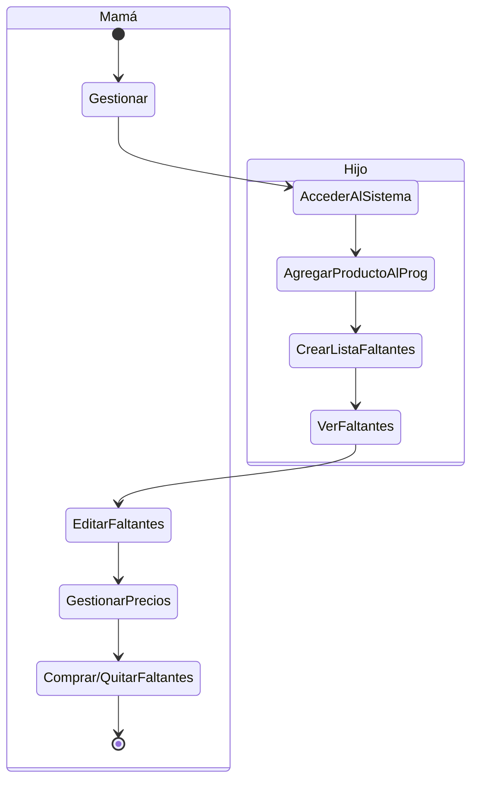

### [Descripción del Proceso](#contenido)

Gestionar Acceso: el Rol Mamá tiene que ingresar al sistema creando por unica vez una contraseña. Luego debe agregar el Rol Hijo para permitir a otro/s usuarios usar el sistema administrándole/s credencial/es de acceso.

Acceder al Sistema: El Rol Hijo/Mamá accede al sistema con las credenciales creadas por Rol Mamá.

Agregar Productos al Prog: Una vez iniciada la sesión Hijo puede agregar productos que no esten aún en la base de datos.

Crear Lista de Faltantes: Con la sessión iniciada Hijo puede buscar los productos faltantes para agregarlos a la Lista de Compras.

Ver Faltantes: El software permite a los usuarios ver la Lista de Productos confeccionada por Hijo, el sistema realizara el cálculo de los precios de los productos faltantes y luego generará una lista detallada de estos y en que Supermercado conviene comprarlos.

Editar Faltantes: El Rol Mamá puede modificar la Lista de Productos faltantes para agregar, o eliminar los innecesarios.

Gestionar Precios: Rol Mamá puede agregar y modificar los precios a cada producto. También debería poder agregar ofertas a estos.

Comprar Faltantes: una vez comprados los productos el Rol Mamá puede limpiar la lista de productos faltantes, estos se almacenaran en un registro de Compras.

# Viabilidad

## [Viabilidad técnica](#contenido)

### Recursos de Hardware

**Especificación de los recursos Hardware**

| Especificación de los recursos  | De Hardware      |
| ------------------------------- | ---------------- |
| Tecnologías de Entrada de datos | Telefono, PC     |
| Tecnologías de Salida           | Telefono, PC     |
| Tecnologías de Procesamiento    | Telefono, PC     |
| Tecnologías de Almacenamiento   | Nube AWS         |
| Tecnologías de Comunicaciones   | WiFi, 3G, 4G, 5G |

### Recursos de Software

**Especificación de los recursos de Software**

| Especificación de los recursos | De software                                    |
| ------------------------------ | ---------------------------------------------- |
| Sistema operativo              | Windows 10, Red Hat 8.5, Android 5 o posterior |
| Lenguaje de programación       | Java 11, MySQL 8                               |
| IDE                            | NetBeans, Android Studio, MySQL Workbench      |
| Base de Datos                  | MySQL 8.0.2x                                   |

## [Viabilidad económica](#contenido)

### Estimación de Costos Hardware

| Recursos   de Hardware                                              | Costos ($) | Proveedor | Garantía / Soporte |
| ------------------------------------------------------------------- | ---------- | --------- | ------------------ |
| →          Tecnologías de Entrada                                   |            |           |                    |
| →          Tecnologías de Salida                                    |            |           |                    |
| →          Tecnologías de Procesamiento   Telefono Celular mod. A10 | $ 40.000   | Samsung   | 1 año de garantía  |
| →          Tecnologías de Almacenamiento   Nube AWS                 | $ 18.934   | Amazon    | 1 año de soporte   |
| →          Tecnologías de Comunicaciones   WiFi, 3G, 4G, 5G         | $ 17.280   | Claro     | 1 año de soporte   |
| Costo Total                                                         | $ 76.214   |           |                    |

### Estimación de Costos del Software a adquirir

| Software                 | Licencia   ($) | Cantidad | Tiempo |
| ------------------------ | -------------- | -------- | ------ |
| Sistema operativo        |                |          |        |
| Lenguaje de programación |                |          |        |
| Antivirus                |                |          |        |
| Costo Total              |                |          |        |

### Estimación de Costos de desarrollo

| Desarrollo e   implantación del Sistema de Información | Costo   | Tiempo |
| ------------------------------------------------------ | ------- | ------ |
| Costo Total                                            | $50.000 | 1 mes  |

### Estimación de Costos del personal

| Equipo de Desarrollo                 | Costos  | Cantidad | Tiempo |
| ------------------------------------ | ------- | -------- | ------ |
| *  Gestor   del proyecto             |         |          |        |
| Ingeniero en Sistemas de Información |         |          |        |
| Analistas de Sistemas                | 120.000 | 1        | 1 mes  |
| Programadores                        | 90.000  | 1        | 1 mes  |
| Tester                               | 70.000  | 1        | 1 mes  |
| Técnico en Ciencia de Datos          | 100.000 | 1        | 1 mes  |
| *  Usuarios   Finales                |         |          |        |
| Usuarios del sistema de información  |         |          |        |
| ** Costo   Total                     | 380.000 | 4        | 1 mes  |

## [Viabilidad operacional](#contenido)

Teniendo en cuenta los resultados de las entrevistas se detectó que los usuarios finales estarán predispuestos a capacitarse y usar el nuevo sistema.

## [Gestión del Proyecto](#contenido)

### Estudio de Riesgos del proyecto

| Tipo de Riesgo | Posible riesgo                                                                                                             |
| -------------- | -------------------------------------------------------------------------------------------------------------------------- |
| Tecnológico    | Falla en la conexión a Internet, mantenimiento del servicio en la nube, error en la implementación, actualización fallida. |
| Personal       | El personal clave está enfermo.                                                                                            |
| Organizacional | Mala comunicación.                                                                                                         |
| Requerimientos | Cambio de requerimientos que solicita el cliente, provocando el rediseño del sistema.                                      |
| Herramientas   | Las herramientas de software no pueden trabajar en una forma integrada.                                                    |

### Calendario del proyecto – Diagrama de Gantt

Falta.

## [Marco de desarrollo](#contenido)

Para el modelo de proceso unificado, el marco de desarrollo es el siguiente:

Referencias: **c**= comenzar, **r** = refinar
|  Disciplinas             |  Artefactos /   Fases             |  Inicio     |  Elaboración     |
|----------------------    |-------------------------------    |---------    |--------------    |
| Modelado del negocio     | Modelo del dominio                |             | c                |
| Requisitos               | Modelo de caso de usos            | c           | r                |
|           "              | Visión                            | c           | r                |
|           "              | Especificación complementaria     | c           | r                |
|           "              | Glosario                          | c           | r                |
| Análisis y diseño        | Modelo del análisis               |             | c                |
| Implementación           | Modelo de implementación          |             | c                |
| Gestión de proyecto      | Plan de desarrollo                | c           | r                |
|           "              | Informe de viabilidad             | c           | r                |
| Pruebas                  | Modelo de Prueba                  |             | c                |
| Entorno                  | Marco de Desarrollo               | c           | r                |

## [Requisitos](#contenido)

### Modelo de Casos de Usos

#### Diagrama

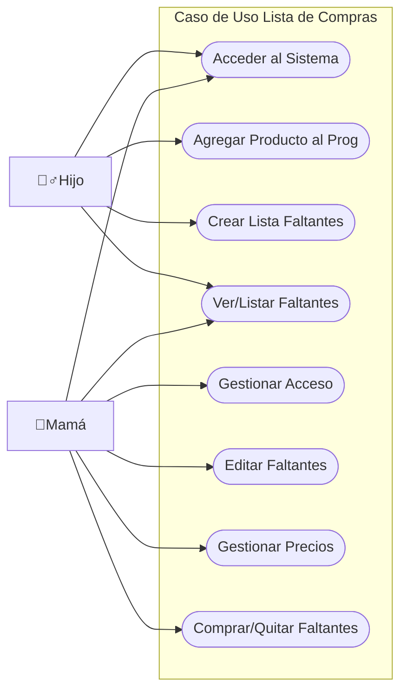

#### Textos

##### Caso De Uso Acceder al Sistema

*Actor principal:* Hijo/Madre.
*Personas involucradas:* Madre.
*Precondiciones:* El sistema espera que el Hijo inicie sesión con los datos provistos por la Madre.
*Postcondiciones:* Sesión iniciada.
*Escenario principal de éxito:*
|     Acción del Actor (o   intención)                     |     Responsabilidad del Sistema                         |
|------------------------------------------------------    |-----------------------------------------------------    |
| 1. El usuario ingresa sus datos de identificación.          | 2. El sistema comprueba el usuario y contraseña.           |
|                                                        | 3. Iniciar sesión.                                         |

*Extensiones:*

1. Error: el usuario no puede ingresar sus datos por problemas de
   hardware. Solución: Comunicarse con el técnico.

2. a) Usuario inexistente. Solución: Comunicarse con el técnico para generar nuevo usuario.
    b) Contraseña Incorrecta. Solución: Comunicars con el técnico para restablecer contraseña.

*Tecnologías:* celular con so Android 5 o posterior.
*Frecuencia:* diario
Cuestiones abiertas: -.

##### Caso De Uso Agregar Producto al Prog

*Actor principal:* Hijo.
*Personas involucradas:* .
*Precondiciones:* Que el Hijo haya iniciado sesión, que la base de datos este creada y en línea.
*Postcondiciones:* Carga del producto faltantes a la base de datos del sistema.
*Escenario principal de éxito:* 
| Acción del Actor (o intención)              | Responsabilidad del Sistema                        |
|---------------------------------------------|----------------------------------------------------|
| 1. El usuario ingresa el producto faltante. | 2. El sistema verifica la integridad de los datos. |
|                                             | 3. El sistema carga los productos faltantes.       |

*Extensiones:*

2 ) ERROR: Los datos ingresados no son correctos. Solución: Ingrese nuevamente los datos.

*Tecnologías:* celular con so Android 5 o posterior.
*Frecuencia:* diario.
*Cuestiones abiertas:* -.

##### Caso De Uso Crear Lista Faltantes

*Actor principal:* Hijo.
*Personas involucradas:* .
*Precondiciones:* Que el Hijo haya iniciado sesión y que los productos se encuentren agregados en la BBDD del sistema.
*Postcondiciones:* Carga de las lista de productos a comprar en la base de datos del sistema.
*Escenario principal de éxito:* 
| Acción del Actor (o intención)                 | Responsabilidad del Sistema                         |
|--------------------------------------------    |-------------------------------------------------    |
| 1. El usuario ingresa los productos faltantes.     | 2. El sistema verifica la integridad de los datos.     |
|                                                | 3. El sistema carga los productos faltantes.                  |

*Extensiones:*

2 ) ERROR: El producto no se encuentra en la BBDD. Solución: Agregue el producto a la base de datos del sistema.

*Tecnologías:* celular con so Android 5 o posterior.
*Frecuencia:* diario.
*Cuestiones abiertas:* -.

##### Caso De Uso Ver Faltantes

*Actor principal:* Hijo, Madre.
*Personas involucradas:* .
*Precondiciones:* Que el Hijo haya iniciado sesión y que haya una Lista de Compras creada y en línea.
*Postcondiciones:* visión de la Lista de Productos faltantes con sus precios mas bajos de acuerdo a los últimos registros.
*Escenario principal de éxito:* 
| Acción del Actor (o intención)                 | Responsabilidad del Sistema                         |
|--------------------------------------------    |-------------------------------------------------    |
| 1. El usuario selecciona ver productos faltantes.     | 2. El sistema verifica los productos agregados a la Lista de Productos.                  |
|                                                | 3. El sistema calcula el menor precio de los productos faltantes.                  |
|                                                | 4. El sistema exhibe los productos faltantes.                  |

*Extensiones:*

2 ) ERROR: No hay productos cargados a la Lista de Productos. Solución: Ingrese los productos.
3 ) ERROR: No hay registros anteriores de los productos cargados a la Lista de Productos. Solución: Ingrese agregue los precios actualizados de cada Supermercado.

*Tecnologías:* celular con so Android 5 o posterior.
*Frecuencia:* diario.
*Cuestiones abiertas:* No tiene que generar un ERROR porque el valor de negocio es una Lista de Compras.

##### Caso De Uso Gestionar Acceso

*Actor principal:* Madre.
*Personas involucradas:* -.
*Precondiciones:* El sistema espera que Mamá cree un perfil para Madre/Hijo.
*Postcondiciones:* Perfil creado con datos de inicio de sesión.
*Escenario principal de éxito:*
|     Acción del Actor (o   intención)                     |     Responsabilidad del Sistema                         |
|------------------------------------------------------    |-----------------------------------------------------    |
| 1. El usuario ingresa sus datos de identificación.          | 2. El sistema comprueba el usuario y contraseña.           |
|                                                        | 3. Iniciar sesión.                                         |

*Extensiones:*

1. Error: el usuario no puede ingresar sus datos por problemas de
   hardware. Solución: Comunicarse con el técnico.

2. a) Usuario inexistente. Solución: Comunicarse con el técnico para generar nuevo usuario.
    b) Contraseña Incorrecta. Solución: Comunicars con el técnico para restablecer contraseña.

*Tecnologías:* celular con so Android 5 o posterior.
*Frecuencia:* diario
Cuestiones abiertas: -.

##### Caso De Uso Editar Faltantes

*Actor principal:* Madre.
*Personas involucradas:* .
*Precondiciones:* Que Madre haya iniciado sesión y que haya una Lista de Compras creada y en línea.
*Postcondiciones:* visión de la pantalla de edición de Lista de Productos faltantes.
*Escenario principal de éxito:* 
| Acción del Actor (o intención)                 | Responsabilidad del Sistema                         |
|--------------------------------------------    |-------------------------------------------------    |
| 1. El usuario selecciona la Lista de Productos para editar.     | 2. El sistema verifica los productos agregados a la Lista de Productos.                  |
|                                                | 3. El sistema exhibe los productos faltantes.                  |
|  4. El usuario modifica la Lista de Productos. | 5. El sistema actualiza la Lista de Productos.                  |

*Extensiones:*

2 ) ERROR: No hay productos cargados a la Lista de Productos. Solución: Ingrese los productos.
5 ) ERROR: Los datos ingresados no son correctos. Solución: Ingrese nuevamente los datos.

*Tecnologías:* celular con so Android 5 o posterior.
*Frecuencia:* diario.
*Cuestiones abiertas:* La idea era que solo Mamá pueda modificar cantidad o eliminar productos de la Lista pero no tiene mucho sentido porque Hijo puede volver a agregarlos, pero en caso de impermitir a Hijo modificar una Lista haría que esta quede desactualizada.

##### Caso De Uso Gestionar Precios

*Actor principal:* Madre.
*Personas involucradas:* .
*Precondiciones:* Que Madre haya iniciado sesión y que haya una Lista de Compras creada y en línea.
*Postcondiciones:* visión de la pantalla de edición de Lista de Productos faltantes.
*Escenario principal de éxito:* 
| Acción del Actor (o intención)                 | Responsabilidad del Sistema                         |
|--------------------------------------------    |-------------------------------------------------    |
| 1. El usuario selecciona la Lista de Productos para editar.     | 2. El sistema verifica los productos agregados a la Lista de Productos.                  |
|                                                | 3. El sistema exhibe los productos faltantes.                  |
|  4. El usuario modifica la Lista de Productos. | 5. El sistema actualiza la Lista de Productos.                  |

*Extensiones:*

2 ) ERROR: No hay productos cargados a la Lista de Productos. Solución: Ingrese los productos.
5 ) ERROR: Los datos ingresados no son correctos. Solución: Ingrese nuevamente los datos.

*Tecnologías:* celular con so Android 5 o posterior.
*Frecuencia:* diario.
*Cuestiones abiertas:* -.

##### Caso De Uso Quitar Faltantes

*Actor principal:* Madre.
*Personas involucradas:* .
*Precondiciones:* Que Madre haya iniciado sesión y que haya una Lista de Compras creada y en línea.
*Postcondiciones:* visión de la pantalla de Finalización de Compra.
*Escenario principal de éxito:* 
| Acción del Actor (o intención)                 | Responsabilidad del Sistema                         |
|--------------------------------------------    |-------------------------------------------------    |
| 1. El usuario selecciona los productos comprados.     | 2. El sistema verifica los productos de la Lista de Productos.                  |
|                                                | 3. El sistema actualiza el Registro de compras y quita los productos seleccionados de la Lista de Compras.                  |

*Extensiones:*

3 ) ERROR: No hay conexión a Internet. Solución: Intente nuevamente.

*Tecnologías:* celular con so Android 5 o posterior.
*Frecuencia:* diario.
*Cuestiones abiertas:* Si el error de conexión persiste quizás se conveniente guardar el registro en un archivo de texto.

## Modelado del Negocio

### [Modelo del Dominio](#contenido)

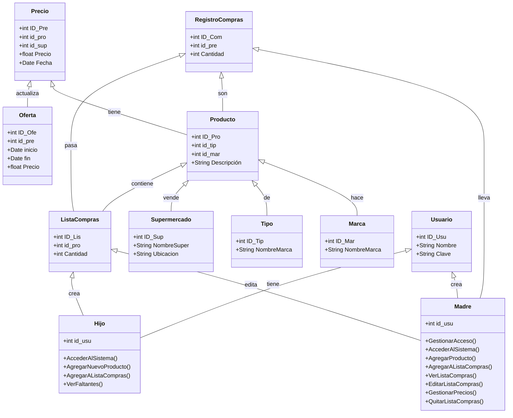

## Análisis y Diseño

### [Modelo del Análisis](#contenido)

Falta.

### [Diagramas de Secuencias del Sistema](#contenido)

Acceder al Sistema
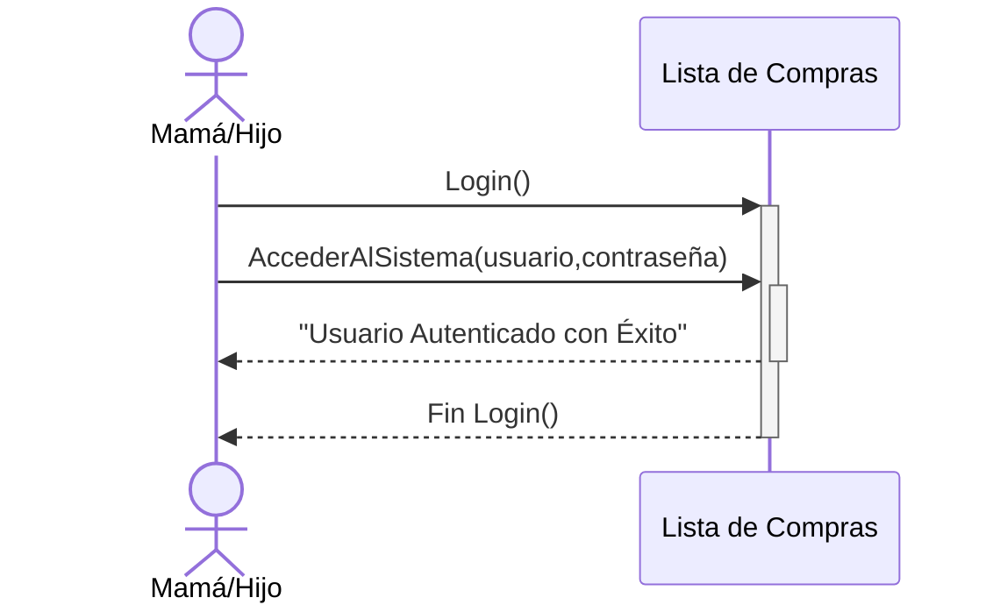

Agregar Producto al Prog
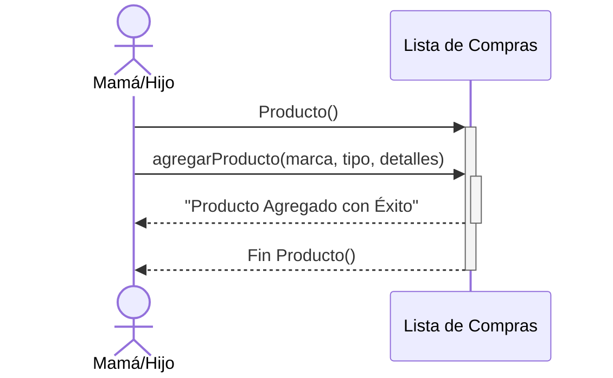

Crear Lista de Faltantes
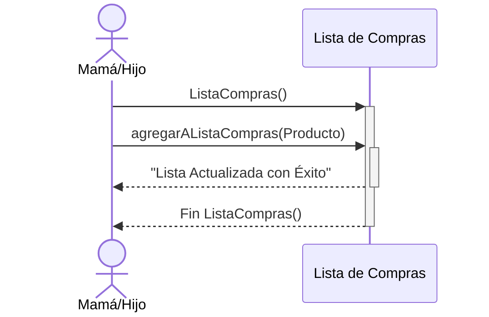

Ver Lista de Faltantes
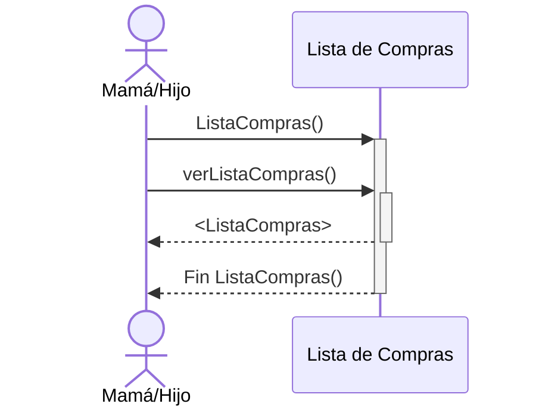

Gestionar Acceso
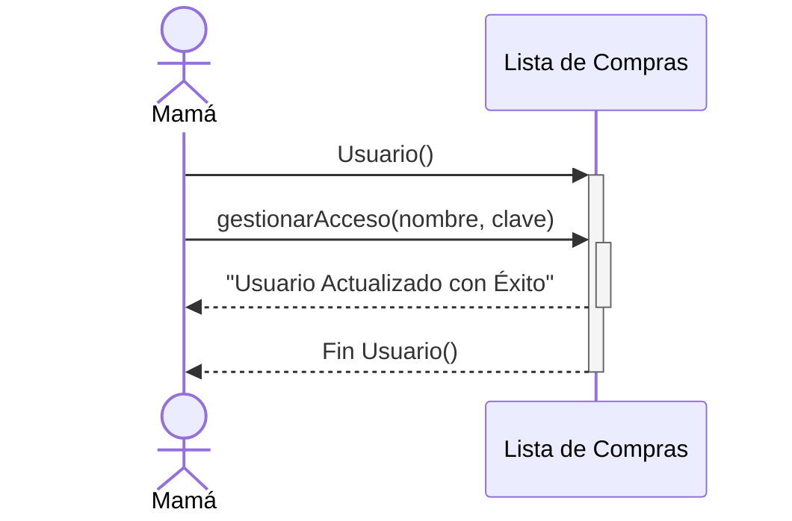

Editar Faltantes
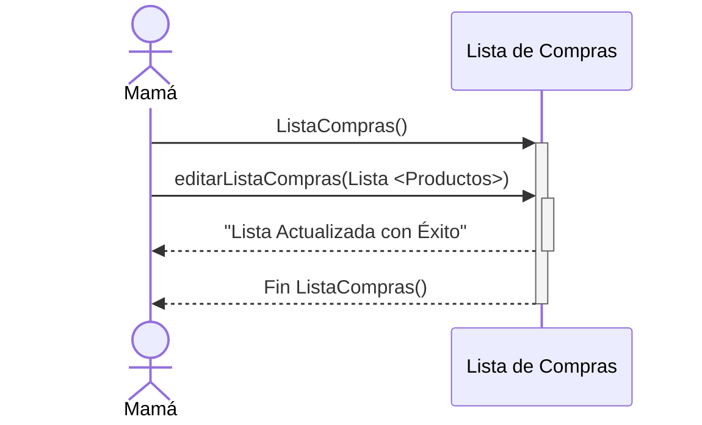

Gestionar Precios
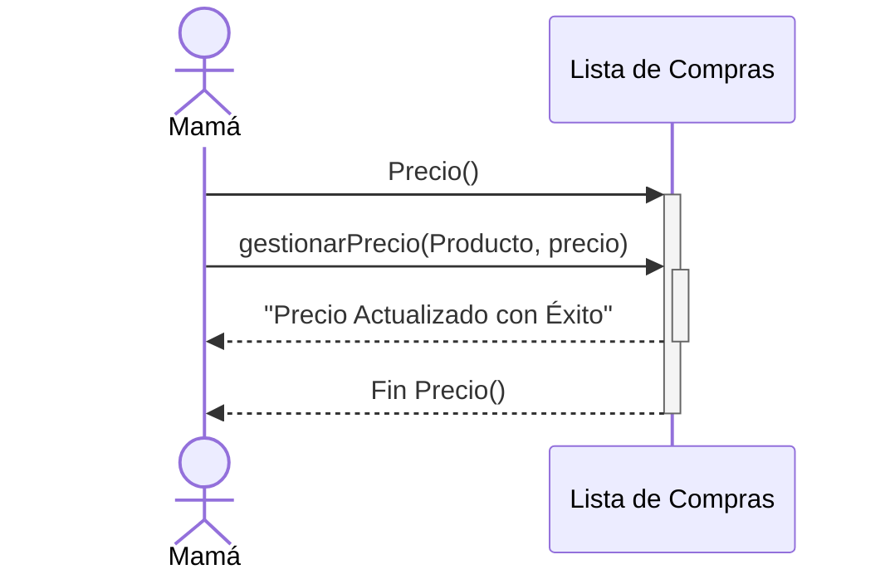

Quitar Faltantes
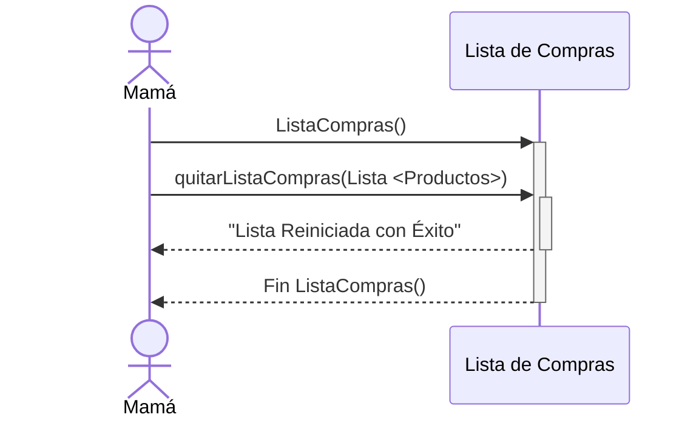

### [Contratos](#contenido)

OPERACIÓN: **AccederAlSistema(usuario,contraseña).**
REFERENCIAS CRUZADAS: caso de uso Acceder al Sistema
PRECONDICIONES: El sistema espera que Hijo inicie sesión con los datos provistos por Mamá.
POSTCONDICIONES: se creó una instancia de Usuario.

OPERACIÓN: **agregarProducto().**
REFERENCIAS CRUZADAS: caso de uso Agregar Producto al Prog.
PRECONDICIONES: Que el usuario haya ingresado exitosamente al sistema.
POSTCONDICIONES: se creó una instancia de Producto.

OPERACIÓN: **crearListaFaltantes(Producto).**
REFERENCIAS CRUZADAS: caso de uso Crear Lista Faltantes.
PRECONDICIONES: Que el usuario haya ingresado exitosamente al sistema.
POSTCONDICIONES: se creó una instancia ListaCompras, ListaCompras se asoció con Producto.

OPERACIÓN: **verFaltantes().**
REFERENCIAS CRUZADAS: caso de uso Ver Faltantes.
PRECONDICIONES: El sistema ya tenga Productos cargados en la Lista.
POSTCONDICIONES: se creó una instancia de ListaCompras.

OPERACIÓN: **gestionarAcceso().**
REFERENCIAS CRUZADAS: caso de uso Acceder al Sistema.
PRECONDICIONES: El sistema espera que Hijo inicie sesión con los datos provistos por Mamá.
POSTCONDICIONES: se creó una instancia de Usuario.

OPERACIÓN: **editarListaProductos(ListaProductos).**
REFERENCIAS CRUZADAS: caso de uso Editar Faltantes.
PRECONDICIONES: El sistema ya tenga Productos cargados en la Lista.
POSTCONDICIONES: se creó una instancia ListaCompras, ListaCompras se asoció con Producto.

OPERACIÓN: **gestionarPrecios(Producto).**
REFERENCIAS CRUZADAS: caso de uso Gestionar Precios.
PRECONDICIONES: El sistema ya tenga Productos cargados.
POSTCONDICIONES: se creó una instancia de Precio, Precio se asoció con Producto.

OPERACIÓN: **quitarFaltantes(ListaProductos).**
REFERENCIAS CRUZADAS: caso de uso Uso Quitar Faltantes.
PRECONDICIONES: El sistema ya tenga los Productos cargados en la Lista.
POSTCONDICIONES: se creó una instancia de RegistroCompras, RegistroCompras se asoció con ListaCompras, Producto y Precio.

## Prototipos

### [Prototipos No Operacionales](#contenido)

Falta.